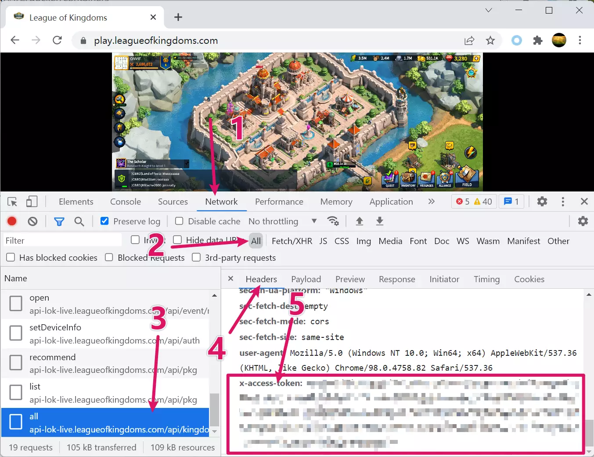

# Disclaimer

```c
#include <std_disclaimer.h>
/*
 *
 * We are not responsible for banned account or any other punishment by this game's GM. 
 * Please do some research if you have any concerns about features included in this repo
 * before using it! YOU are choosing to use these scripts, and if
 * you point the finger at us for messing up your account, we will laugh at you.
 *
 */
```

# lok_bot


[](https://github.com/hldh214/lok_bot/issues)
[](https://github.com/hldh214/lok_bot/network)
[](https://github.com/hldh214/lok_bot/stargazers)
[](https://github.com/hldh214/lok_bot/blob/master/LICENSE.md)

Yet another League of Kingdoms farming bot

# Features

|            Feature            |                                 Supported?                                  |
|:-----------------------------:|:---------------------------------------------------------------------------:|
|          claim mail           |                                    ✔YES️                                    |
|       buy caravan items       |                                    ✔YES️                                    |
|      use resource items       |                                    ✔YES️                                    |
| claim chests(vip/silver/gold) |                                    ✔YES️                                    |
|       harvest resources       |                                    ✔YES️                                    |
|         alliance help         |                                    ✔YES️                                    |
|       alliance research       |                                    ✔YES️                                    |
|    alliance shop auto buy     |                                    ✔YES️                                    |
|    quest reward auto claim    |                                    ✔YES️                                    |
|       building upgrade        |                                    ✔YES️                                    |
|       academy research        |                                    ✔YES️                                    |
|         train troops          |                                    ✔YES️                                    |
|         field farming         |                                    🚧WIP                                    |

# Usage

## Run with local Python interpreter

### Prerequisites

- [Python3.10](https://www.python.org/downloads/)
- [Pipenv](https://pipenv.pypa.io/en/latest/)

### Clone or download the repo

```shell
git clone https://github.com/hldh214/lok_bot.git
# or click "Download Zip" button
```

### Install requirements

```shell
cd lok_bot
pipenv sync
```

### Run

```shell
# Use the UTF-8 mode on Windows
export PYTHONUTF8=1

# activate a new shell with pipenv
pipenv shell
python -m lokbot YOUR_X_ACCESS_TOKEN

# or run directly inside pipenv
pipenv run python -m lokbot YOUR_X_ACCESS_TOKEN
```

## Run with Docker

### Build image yourself

```shell
docker buildx build -t lok_bot_local --build-arg PYPI_MIRROR=https://pypi.tuna.tsinghua.edu.cn/simple .
docker run -e TOKEN=YOUR_X_ACCESS_TOKEN lok_bot_local
```

### Or use prebuilt image

[](https://github.com/hldh214/lok_bot/pkgs/container/lok_bot)

```shell
docker run -e TOKEN=YOUR_X_ACCESS_TOKEN ghcr.io/hldh214/lok_bot

# or use your own config
docker run -v $PWD/config.json:/app/config.json -e TOKEN=YOUR_X_ACCESS_TOKEN ghcr.io/hldh214/lok_bot
```

# Configuration

```json5
{
  "main": {
    "jobs": [
      {
        // name, DO NOT change
        "name": "alliance_farmer",
        // or false to disable this job
        "enabled": true,
        "kwargs": {
          // or false to disable gift claiming
          "gift_claim": true,
          "help_all": true,
          "research_donate": true,
          // or null if you don't want to auto buy items in alliance shop
          "shop_auto_buy_item_code_list": [
            // ITEM_CODE_VIP_100
            10101008
          ]
        },
        // Run every 120 to 200 minutes.
        "interval": {
          "start": 120,
          "end": 200
        }
      },
      {
        // experimental
        "name": "socf_thread",
        "enabled": true,
        "kwargs": {
          "object_code_list": [
            // OBJECT_CODE_CRYSTAL_MINE
            20100105,
            // OBJECT_CODE_GOBLIN
            20200104
          ],
          // radius of the zone to search, center: your castle, unit: zone
          // P.S. one zone contains 4x4 lands, please refer to: https://github.com/hldh214/lok_bot/blob/master/docs/land.md
          "radius": 8
        },
        // Run every 1 minutes.
        "interval": {
          "start": 1,
          "end": 1
        }
      }
    ],
    "threads": [
      {
        // name, DO NOT change
        "name": "building_farmer_thread",
        "enabled": true,
        "kwargs": {
          // if you want to use speedup items
          "speedup": true
        }
      },
      {
        "name": "academy_farmer_thread",
        "enabled": true,
        "kwargs": {
          // true if you want to research max level, else it will only level up to the minimum required level
          "to_max_level": false
        }
      }
    ]
  }
}
```

# X_ACCESS_TOKEN

There are currently no plans to support login functionality. So we need this `X_ACCESS_TOKEN` trick to made it works.



You need to log in on the web, then press F12 to open [DevTools](https://developer.chrome.com/docs/devtools/open/). Then
click `Network` tab(1)(2), scroll down to the latest request and click it(3). On the right side(4) scroll down to the
bottom, and you can see `x-access-token` field(5). Copy that value and pass it as `X_ACCESS_TOKEN` mentioned above.

# Buy Me a Coffee

ETH/Matic: 0x27C7993CC3349DDE839B4F921733CFc523385864

# References

https://github.com/miguelgrinberg/python-socketio/blob/v4.6.1/docs/client.rst
https://github.com/bambusbjoerni/bambusbjoerni.github.io
